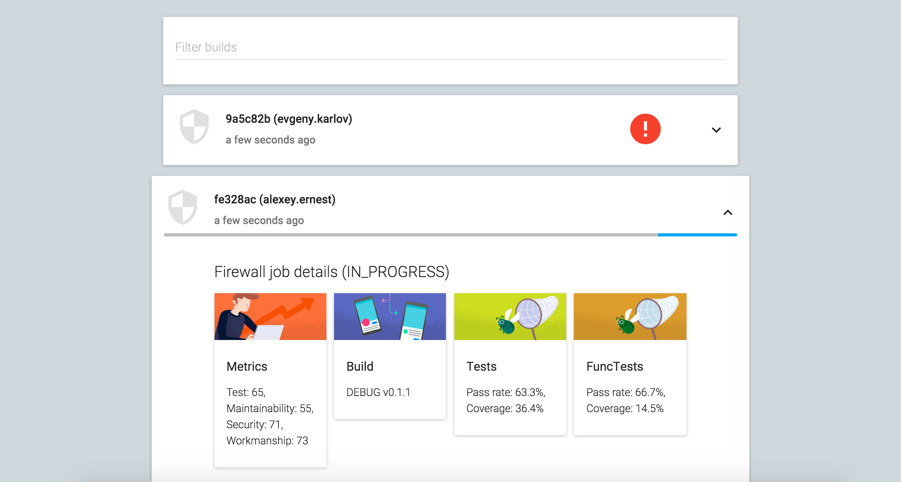

# ci-list
CI build list UI

## Deployment
https://ci-list.firebaseapp.com/

## Technologies
* Lang: JavaScript/ES6/ES7/Babel
* Frameworks: React/Flux, Material UI components, SASS Susy grid, SASS Breakpoint responsive layout, Compass
* Tools: eslint, webpack (build), jest (unit and snapshot testing), git (source control), travis (ci server), coveralls (test coverage data), firebase (deployment)
